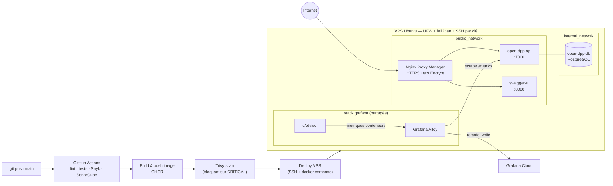

# ITER open DPP API

API ouverte exposant les passeports produits numériques (Digital Product
Passport) d'ITER : consultation d'un passeport par GTIN, documentée en
OpenAPI et servie derrière Swagger UI. Projet MyDigitalStartup — dockerisé,
livré par un pipeline CI/CD, déployé sur un VPS durci, avec observabilité et
documentation dédiées.

- **API en prod :** https://api.jules.ruberti.mds-nantes.fr (`/health`, `/metrics`, `/api`)
- **Swagger UI :** https://swagger.jules.ruberti.mds-nantes.fr
- **Qualité de code (SonarQube) :** https://sonarqube.jules.ruberti.mds-nantes.fr
- **Grafana Cloud :** https://eagerclover2062.grafana.net — dashboard importable depuis [`observability/dashboard-vps.json`](observability/dashboard-vps.json), voir [ADR 004](docs/adr/0004-observabilite-prometheus-alloy.md)
- **Images Docker :** [ghcr.io/julesssssssssssss/iter-open-api](https://github.com/JulesSsssssssssss/iter-open-api/pkgs/container/iter-open-api)

## Sommaire

- [Architecture](#architecture)
- [Lancer en local](#lancer-en-local)
- [Déployer](#déployer)
- [Rollback](#rollback)
- [Contribuer](#contribuer)
- [Variables d'environnement](#variables-denvironnement)
- [Sécurité](#sécurité)
- [Observabilité](#observabilité)
- [Documentation complémentaire](#documentation-complémentaire)

## Architecture

Trois conteneurs applicatifs (`compose.yml` / `compose.prod.yml`), un pipeline
CI/CD GitHub Actions, et une stack d'observabilité VPS partagée avec d'autres
projets.



- **`internal_network`** : la base PostgreSQL n'est joignable que par l'API.
  Voir [ADR 001](docs/adr/0001-segmentation-reseau-docker.md).
- **`public_network`** : partagé entre l'API, Swagger UI, Nginx Proxy Manager,
  et Grafana Alloy (pour le scrape des métriques applicatives).
- Le VPS héberge aussi d'autres projets (Vaultwarden, portfolio, SonarQube)
  derrière le même Nginx Proxy Manager et la même stack d'observabilité — non
  représentés ici pour la lisibilité.

## Lancer en local

Prérequis : Docker + Docker Compose v2.

```bash
git clone git@github.com:JulesSsssssssssss/iter-open-api.git
cd iter-open-api

# 1. Copier et adapter les variables d'environnement
cp .env.example .env

# 2. Créer le réseau externe partagé (une seule fois)
docker network create public_network

# 3. Lancer la stack (build de l'image API inclus)
docker compose up --build
```

- API : http://localhost/api, http://localhost/health, http://localhost/metrics
- Swagger UI : http://localhost:81
- Arrêt complet (avec suppression des volumes, y compris les données Postgres) :
  `docker compose down -v`

## Déployer

Le déploiement est entièrement automatisé par `.github/workflows/go.yml` : tout
push sur `main` déclenche, dans l'ordre, `lint` → `security` (Snyk) → `tests` →
`quality` (SonarQube) → `build-and-push` (image GHCR taguée `latest` et
`${{ github.sha }}`) → `trivy-scan` (bloquant sur CRITICAL) → `deploy`.

Le job `deploy` :
1. Copie `compose.prod.yml` sur le VPS (`~/iter-open-api`).
2. Se connecte en SSH, `docker login` sur GHCR avec un token éphémère (celui
   du run, rien de stocké côté serveur).
3. `docker compose -f compose.prod.yml pull && up -d`, puis nettoie les
   anciennes images (`docker image prune -f`).

Secrets GitHub requis (Settings → Secrets and variables → Actions) :
`SSH_HOST`, `SSH_USER`, `SSH_PORT`, `SSH_PRIVATE_KEY`, `SNYK_TOKEN`,
`SONAR_TOKEN`, `SONAR_HOST_URL`.

**Premier déploiement sur un nouveau VPS** (une seule fois, manuellement) :
s'assurer que `public_network` existe (`docker network create public_network`),
que le `.env` de production (`POSTGRES_*`) est déposé à côté de
`compose.prod.yml`, et que Nginx Proxy Manager route les domaines voulus vers
`open_dpp_api:7000` et `iter_swagger_ui:8080`.

### Rollback

En cas de déploiement fautif détecté (voir
[runbook API down](docs/runbooks/api-down.md)) :

```bash
ssh VPS_MDS
cd ~/iter-open-api
# Remplacer :latest par le SHA du dernier commit connu sain
# (visible dans l'historique des runs GitHub Actions, ou `git log`)
docker pull ghcr.io/julesssssssssssss/iter-open-api:<sha-precedent>
docker tag ghcr.io/julesssssssssssss/iter-open-api:<sha-precedent> \
           ghcr.io/julesssssssssssss/iter-open-api:latest
docker compose -f compose.prod.yml up -d
```

Le prochain déploiement automatique republiera la version corrigée de `main`
sur le tag `latest`, écrasant ce rollback temporaire — le rollback est un
palliatif le temps de corriger et repush, pas une solution durable.

## Contribuer

```bash
cd open-api
go vet ./... && go test -v ./...                 # tests (aussi lancés en CI)
golangci-lint run ./...                          # lint (aussi lancé en CI, v2.12.2)
```

- Toute PR vers `main` déclenche le pipeline complet (lint/tests/scans) sans
  déployer — seul un push direct sur `main` déploie.
- Convention de commits observée sur ce repo : préfixe `fix:` / `feature:` /
  `chore:` suivi d'une description courte à l'impératif (voir `git log`).
- Toute décision d'architecture non triviale mérite un
  [ADR](#documentation-complémentaire) plutôt qu'un simple commentaire de code.

## Variables d'environnement

Définies dans `.env` à la racine (copié depuis `.env.example`, jamais commité) :

| Variable | Rôle | Exemple |
| --- | --- | --- |
| `POSTGRES_USER` | Utilisateur PostgreSQL | `user-iter-open` |
| `POSTGRES_PASSWORD` | Mot de passe PostgreSQL (secret) | — |
| `POSTGRES_DB` | Nom de la base | `db-iter-open` |
| `API_PORT` | Port de référence de l'API (le port réellement écouté par le process Go est fixé à `7000` dans `open-api/main.go`) | `7000` |

En CI/CD, les secrets sont gérés côté GitHub Actions (voir
[Déployer](#déployer)), jamais dans un fichier commité.

## Sécurité

- SSH par clé uniquement (`PermitRootLogin no`, `PasswordAuthentication no`),
  `fail2ban` actif, UFW en *deny incoming* par défaut (22/80/443 seuls ouverts).
- HTTPS forcé partout via Nginx Proxy Manager (Let's Encrypt, HSTS, HTTP/2).
- Base de données jamais exposée publiquement — voir
  [ADR 001](docs/adr/0001-segmentation-reseau-docker.md).
- Scan Trivy bloquant sur CRITICAL avant tout déploiement — voir
  [ADR 003](docs/adr/0003-pipeline-cicd-versions-pinnees.md).
- Incident détecté et corrigé : port admin Nginx Proxy Manager exposé
  publiquement malgré UFW — voir [ADR 002](docs/adr/0002-hardening-npm-port-admin.md)
  et le [runbook associé](docs/runbooks/port-expose.md).

## Observabilité

- L'API expose des métriques Prometheus natives sur `/metrics`
  (`http_requests_total`, `http_request_duration_seconds`, métriques runtime
  Go) — voir [ADR 004](docs/adr/0004-observabilite-prometheus-alloy.md).
- Scrapées par la stack Grafana Alloy + cAdvisor déjà présente sur le VPS,
  remontées vers Grafana Cloud.
- Dashboard prêt à l'emploi : [`observability/dashboard-vps.json`](observability/dashboard-vps.json)
  (CPU/RAM/réseau/disque par conteneur + requêtes/latence/erreurs de l'API).

## Documentation complémentaire

- **ADR** (Architecture Decision Records) — [`docs/adr/`](docs/adr/)
  1. [Segmentation réseau Docker](docs/adr/0001-segmentation-reseau-docker.md)
  2. [Hardening port admin NPM](docs/adr/0002-hardening-npm-port-admin.md)
  3. [Versions pinnées et scan bloquant en CI/CD](docs/adr/0003-pipeline-cicd-versions-pinnees.md)
  4. [Observabilité Prometheus + Alloy](docs/adr/0004-observabilite-prometheus-alloy.md)
- **Runbooks** — [`docs/runbooks/`](docs/runbooks/)
  1. [API down](docs/runbooks/api-down.md)
  2. [Pipeline CI/CD en échec](docs/runbooks/pipeline-echec.md)
  3. [Port exposé publiquement par erreur](docs/runbooks/port-expose.md)
- [RECAP.md](RECAP.md) — historique détaillé des bugs rencontrés et corrigés,
  axe par axe.
- [Spécification OpenAPI](open-api/docs/specification.yml)
